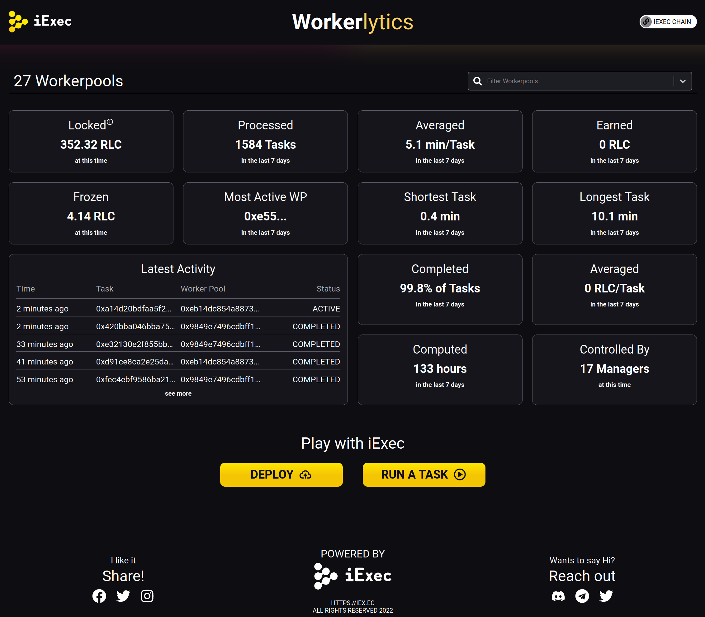
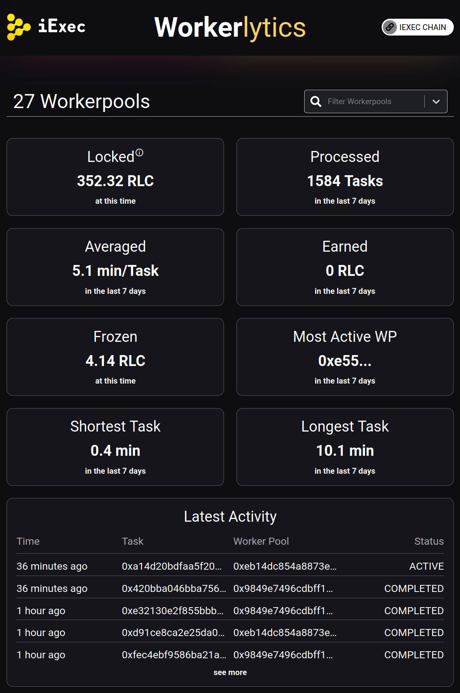

# iExec Workerlytics Dashboard

## Intro

The iExec Workerlytics Dashboard makes it very simple to query and visualize iExec workerpools activity.

## Demo

[https://workerlytics.vercel.app](https://workerlytics.vercel.app)

## Screenshots





## Features

- [x] responsive design (desktop, tablet, mobile)
- [x] metrics for all, multi or single workerpool

## Metrics

- [x] Locked RLC
- [x] Processed Tasks
- [x] Average processing time per task
- [x] Earned RLC
- [x] Frozen RLC
- [x] Most active WP
- [x] Shortest Task
- [x] Longest Task
- [x] Latest Activity
- [x] Completed tasks (%)
- [x] Average earning per Task
- [x] Total computing time
- [x] Number of WP Managers

## Dev Instructions

```bash
npm i  # install node modules
npm start  # start the dev environment
npm build  # build a production version of the application
```
